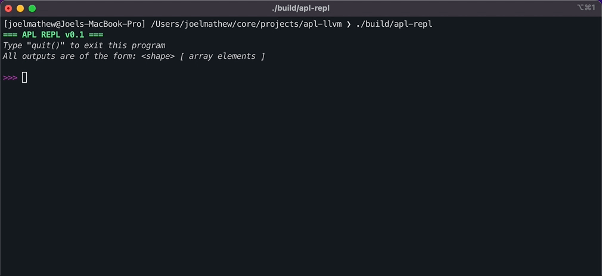
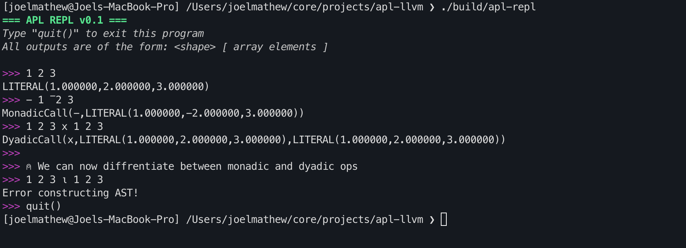
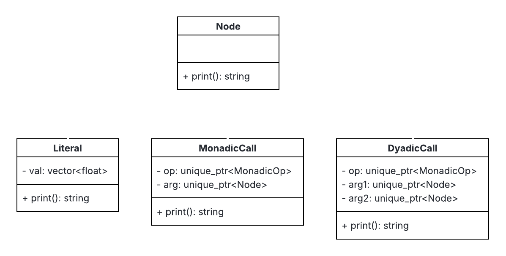
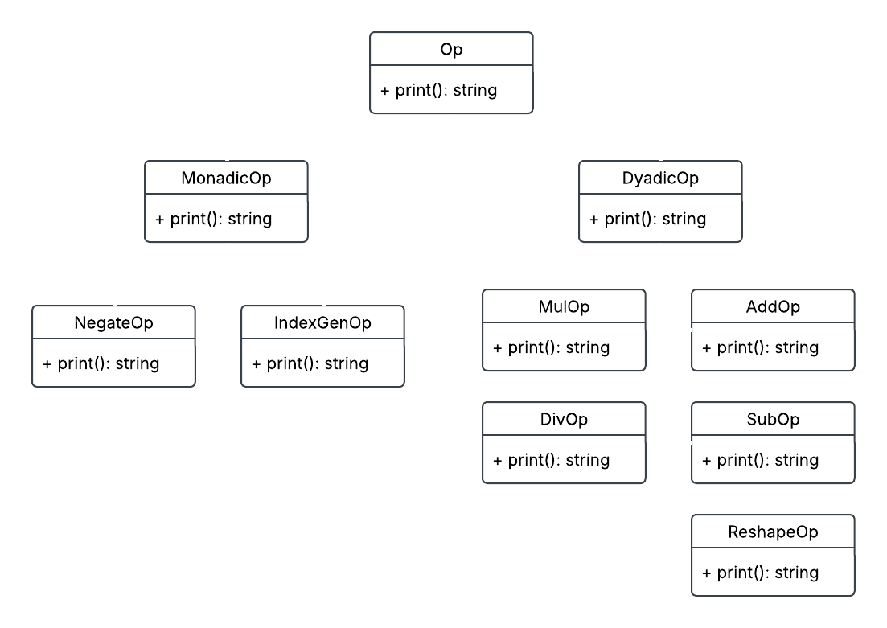
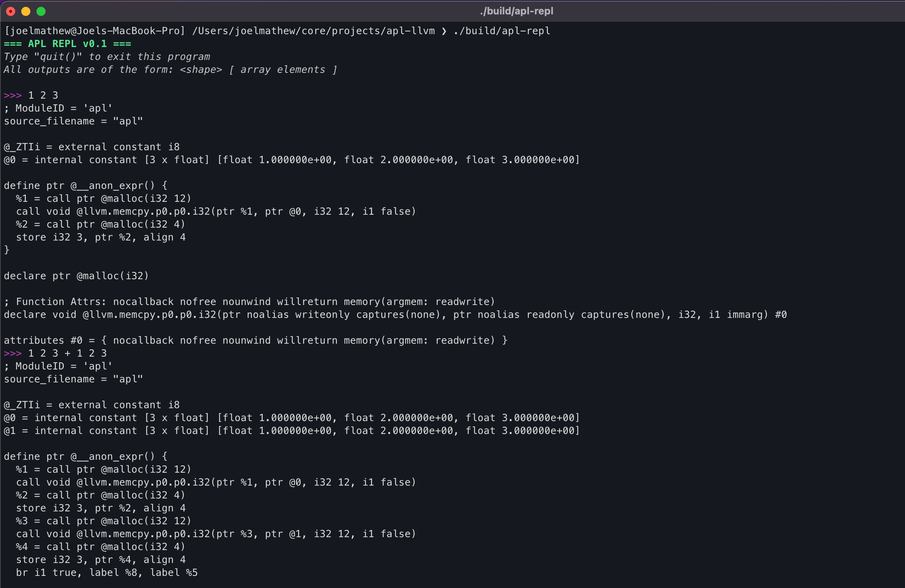
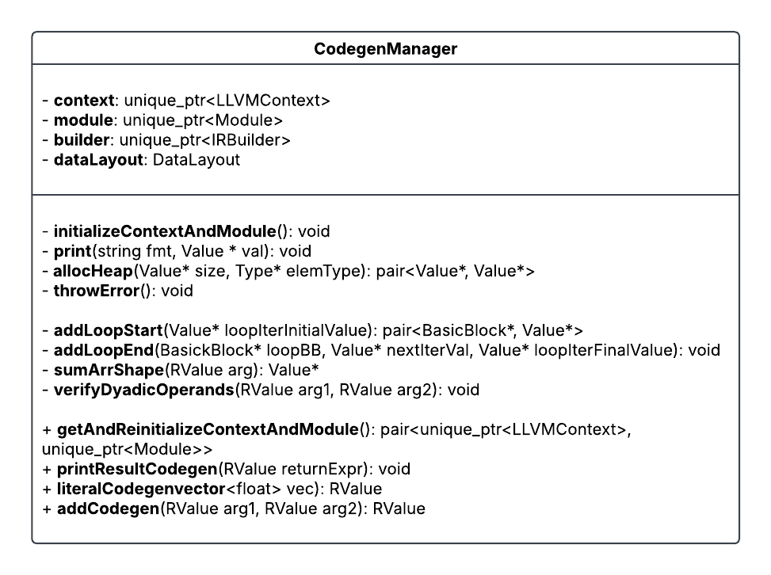
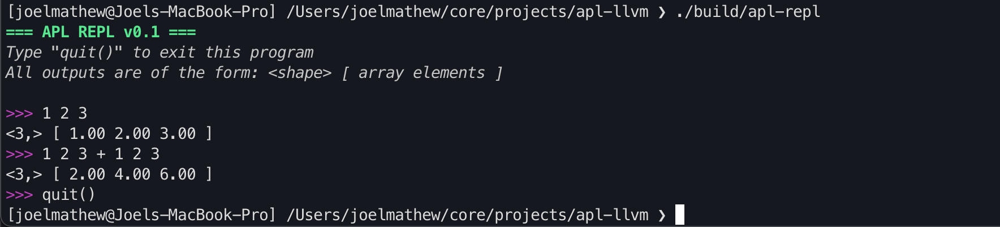

If you have ever considered compiler development as a profession, you have definitely come face-to-face with a line in the job description that goes something like this

Must have Low Level Virtual Machine (LLVM) experience

This blog post explores LLVM and provides a tutorial on how to use it to write a compiler for the APL programming language ([code repository](https://github.com/JoelMathewC/apl-llvm)).



## What is LLVM?

LLVM was introduced in the paper ["LLVM: A Compilation Framework for Lifelong Program Analysis & Transformation"](https://dl.acm.org/doi/abs/10.5555/977395.977673) in 2004. The paper argues for **program analysis at various stages of a program's lifetime**. These analyses allow for 4 classes of optimizations
- _Interprocedural_: Those performed at link time, such as static debugging and static leak detection.
- _Machine-Dependent_: Those performed at install time.
- _Dynamic_: Those performed at runtime.
- _Profile-Guided_: Those performed between runs.

An LLVM-based compiler consists of a user-defined static frontend that converts the source language into an LLVM intermediate representation. It is expected that during this conversion, users will perform source-language-specific optimizations themselves, as LLVM will not preserve source-language semantics to exploit certain optimization opportunities. The linker then performs a series of link-time optimizations. The code is then compiled into a binary, and the LLVM representation is saved alongside it (it is also possible to JIT-compile the code). The binary contains instrumentation to extract profile data, which can be used to optimize at runtime.

The core of LLVM is the **intermediate representation (IR)**. This IR is expected to be high-level enough to cover a wide range of optimizations and low-level enough to represent arbitrary programs. LLVM achieves this through a RISC-like instruction set that is only slightly more expressive than standard assembly. The additional features include
- A type system that can be used to implement data types and associated operations
- Instructions for performing type conversions and address arithmetic
- Two exception handling instructions (unwind and invoke)

The LLVM IR can be thought of as the assembly for an abstract machine with **load-store architecture** and infinite registers. The instruction set contains **31 opcodes**, most of which are overloaded (add works on int and float types). To allow for easier analysis, each register has a type, and all operations are in **Single Static Assignment form** (meaning that each register is only written to once). The type of a register can be a **primitive type** (void, bool, signed/unsigned int of 8-64 bits, and single/double precision floating point) or a **derived type** (pointers, arrays, structures, and functions).  Functions in LLVM consist of a **set of basic blocks**, where each block is a sequence of LLVM instructions that ends with one terminator (branches, return, unwind, or invoke). Exceptions in LLVM are handled through **invoke and unwind**. Invoke works similarly to a call instruction, with an additional specification of a basic block to execute in the event of an exception. The unwind starts popping stack frames till an invoke block is encountered. 

LLVM has seen large-scale adoption across the industry. The popular C++ compiler `clang` is written using LLVM. To illustrate the LLVM IR, you can find below a small C++ program along with its associated LLVM IR (can be generated by running `clang -S -emit-llvm <cpp-file-name>`).

```c++
int main() {
  int arr1[] = {1, 2, 3};
  for (int i = 0; i < 3; ++i) {
    arr1[i] = 0;
  }
  return 0;
}
```

```llvm
@__const.main.arr1 = private unnamed_addr constant [3 x i32] [i32 1, i32 2, i32 3], align 4

; Function Attrs: mustprogress noinline norecurse nounwind optnone ssp uwtable
define noundef i32 @main() #0 {
  %1 = alloca i32, align 4
  %2 = alloca [3 x i32], align 4
  %3 = alloca i32, align 4
  store i32 0, ptr %1, align 4
  call void @llvm.memcpy.p0.p0.i64(ptr align 4 %2, ptr align 4 @__const.main.arr1, i64 12, i1 false)
  store i32 0, ptr %3, align 4
  br label %4

4:                                                ; preds = %11, %0
  %5 = load i32, ptr %3, align 4
  %6 = icmp slt i32 %5, 3
  br i1 %6, label %7, label %14

7:                                                ; preds = %4
  %8 = load i32, ptr %3, align 4
  %9 = sext i32 %8 to i64
  %10 = getelementptr inbounds [3 x i32], ptr %2, i64 0, i64 %9
  store i32 0, ptr %10, align 4
  br label %11

11:                                               ; preds = %7
  %12 = load i32, ptr %3, align 4
  %13 = add nsw i32 %12, 1
  store i32 %13, ptr %3, align 4
  br label %4, !llvm.loop !6

14:                                               ; preds = %4
  ret i32 0
}
```

Now that we have discussed the basics of LLVM, the best way to understand these concepts is to build a small compiler using it. The following section of this blog post focus on that.

## Tutorial

The purpose of this tutorial is to familiarize readers with LLVM IR and, specifically, its code generation. So we will not touch on optimization passes or other components of the LLVM stack (hopefully a future blog post will). Since we’re going to build a compiler, the first step is to identify a language that our compiler should compile. The [official LLVM tutorial](https://llvm.org/docs/tutorial/MyFirstLanguageFrontend/index.html) develops a compiler for a fictitious language named Kaleidoscope. In this tutorial, I document the process of creating a compiler for the APL programming language.

APL is a programming language introduced in Kenneth Iverson’s Turing award-winning paper titled “Notation as a tool of thought”. I came across this paper in a compiler class I took during graduate school. As a part of the class, we had to build an APL2C compiler that generated C kernels for various APL expressions. While working on the project, I started aligning with the corner of the programming community that rallied behind APL as a reasonable programming language :). As such, it must be noted that there are a ton of open-source APL compilers; however, the most widely used APL compiler, Dyalog, is not open-source but free.

If you’re interested in building an APL compiler, I would recommend [this resource](https://xpqz.github.io/learnapl/intro.html), as it covers the language in great detail. However, if you’re just here for the LLVM bits, some of my not-so-complete explanation should get you by. Throughout this tutorial, we’ll build the APL compiler to match APL's functionality as outlined in the resource above. We’ll build the compiler in C++.

This blog post splits the process of writing a compiler into four stages, the completed code at each stage is available on seperate GitHub branches as indicated below

| SNo. | Stage | GitHub branch |
|-|-|-|
| 1 | Lexer and Parser | [stage1/lexer-parser](https://github.com/JoelMathewC/apl-llvm/tree/stage1/lexer-parser) |
| 2 | AST Construction | [stage2/ast-construct](https://github.com/JoelMathewC/apl-llvm/tree/stage2/ast-construct) |
| 3 | LLVM Codegen | [stage3/llvm-codegen](https://github.com/JoelMathewC/apl-llvm/tree/stage3/llvm-codegen) |
| 4 | JIT Compiler | [stage4/jit-compiler](https://github.com/JoelMathewC/apl-llvm/tree/stage4/jit-compiler) |

### Quick APL Primer

APL was not originally intended to be a programming language. It would be more appropriate to call it a set of notations that can be strung together to express algorithms. APL programs consist of a combination of numeric literals and operator symbols (and a few other things that we'll conveniently ignore). APL has around 30 operator symbols, most of which are overloaded to imply different meanings when used in monadic or dyadic contexts. Below, we enumerate some APL basics ahead of our discussion on how we built a compiler for it.

1. **Comments**: Comments in APL always start with the lamp symbol `⍝`.
2. **Arrays**: All numerical literals are assumed to be arrays. Separating numerical literals by space allows us to construct a 1D array of multiple elements. 
   ```apl
   >> 1
   [ 1 ]
   >> 1 2 3
   [ 1 2 3 ]

   ⍝ Negative numbers are prefixed with the high minus (¯) specifier. 
   >> 1 ¯2 3
   [ 1 -2 3 ]
   ```
3. **Monadic Operators**: Monadic operators are those that act upon a single operand. Monadic operators always have their operand listed to the right. APL consists of numerous monadic operators, but we will restrict our analysis to the negate (`-`) and index generator (`⍳`) operators.
   ```apl
   >> - 1 ¯2 3
   [ -1 2 -3 ]

   ⍝ The operator generates an array with data [ 1, 2, ...operand ]
   >> ⍳5
   [ 1 2 3 4 5 ]
   ```
4. **Dyadic Operators**: Dyadic operators are those that act upon two operands on either side of the operator. APL consists of numerous dyadic operators, but we will restrict our analysis to the add (`+`), subtract (`-`), multiply (`x`), divide (`÷`), and reshape (`⍴`) operators. Note how the negate monadic operator and the subtract dyadic operator use the same symbol.
   ```apl
   >> 1 2 3 + 1 2 3
   [ 2 4 6 ]
   >> 1 2 3 - 1 2 3
   [ 0 0 0 ]
   >> 1 2 3 x 1 2 3
   [ 1 4 9 ]
   >> 1 2 3 ÷ 1 2 3
   [ 1 1 1 ]

   ⍝ The left hand side indicates the target shape 
   ⍝ and right side indicates the data.
   >> 2 2 ⍴ 1 2 3 4
   [[1 2], [3 4]]
   ```

The compiler we build will be limited to just these APL features since that simplifies implementation significantly.

### Stage 1: Lexer and Parser

Parsing is the process of converting a string of characters that form a program into some logical representation we can analyse. The logical representation in this case is an abstract syntax tree, but we’ll get to that in the next section. When it comes to parsing, we have several options. I wrote my first compiler using the Lex/YACC parser generator, but Flex/Bison are a little more popular than those variants because they are free and open source. I will note that whether you use a parser generator is up to you; many folks prefer to write their own parsers for the languages they build, but for this tutorial, I will use Flex/Bison. You may find this introduction to [Flex](https://web.stanford.edu/class/archive/cs/cs143/cs143.1128/handouts/050%20Flex%20In%20A%20Nutshell.pdf) and [Bison](https://web.stanford.edu/class/archive/cs/cs143/cs143.1128/handouts/120%20Introducing%20bison.pdf) useful as a reference. If you decide to work with Flex/Bison, use your machine's package manager to install both tools.

At the end of this section, we will have an interface capable of parsing APL programs and flagging certain classes of syntax errors.


#### Bison

Bison is a parser generator that takes a grammar description as input and generates C/C++ parser code that adheres to that grammar. Naturally, the follow-up question here is: what is grammar?

A grammar is a description of the syntax of a language. Grammars consist of a set of production rules that can be recursively applied to a sequence of terminal tokens to generate a parsing tree. Each rule consists of tokens that can be either terminal or non-terminal.

- **Terminal Tokens**: These tokens do not expand further and hence occur only on the RHS of a rule. We represent these tokens with uppercase characters.
- **Non-Terminal Tokens**: these tokens are expected to expand further and can therefore occur on either the RHS or the LHS of a rule. We represent these tokens with lowercase characters.

Our limited APL language has a very simple grammar, as shown below.
```c++ {linenos=true}
start: prgm INPUT_COMPLETED {YYACCEPT;}
    | INPUT_COMPLETED       {YYACCEPT;}
    | EXIT                  {exit(0);}

prgm: op_expr           {} 

op_expr: '(' op_expr ')'        {}
    | OPERATOR op_expr          {}    
    | op_expr OPERATOR op_expr  {}    
    | array                     {}

array: array LITERAL                {}
    | array HIGH_MINUS LITERAL      {}
    | HIGH_MINUS LITERAL            {}
    | LITERAL                       {}
```

- This grammar description has 5 terminal tokens: `INPUT_COMPLETED`, `EXIT`, `OPERATOR`, `HIGH_MINUS`, and `LITERAL`.
- **Lines 12-15** indicate that an array can be a single positive or negative number or a collection of positive and negative numbers. It is important to note that we can obtain recursive behaviour by using the same non-terminal token on either side of the rule.
- **Lines 7-10** indicate that an operation expression can be monadic or dyadic. Due to the recursive usage of the **op_expr** non-terminal token, we get the capability of composing operations together.
- **Line 5** indicates that a valid APL program is any **op_expr**. The intent of having a separate rule here is so that if we decide to extend APL to support some of its other features we can append to the rule with or conditions here.
- **Lines 1-3** indicate that `EXIT` should result in the termination of the program, and `INPUT_COMPLETED` should stop the parser from looking for more inputs.

To generate the parser from the grammar description (`parser.y`), run the following command
```bash
bison -o parser.tab.c --defines=parser.tab.h parser.y
```

If you are interested in seeing what the grammar for a more complicated OOP language looks like, you can take a look at [this](https://github.com/JoelMathewC/eXpl/blob/main/code.y). 

#### Flex

The parser's role is to group a stream of terminal tokens into a syntactically valid program, but how do we go from a character stream to a terminal token stream?

The lexer is responsible for that. Flex is a lexer generator that converts a character stream into terminal tokens using a series of string-matching rules.

```c++ {linenos=true}
[ \t]+     {}
(⍝.*)       {}

"\n"        {return token::INPUT_COMPLETED;}
"quit()"    {return token::EXIT;}

"¯"         {return token::HIGH_MINUS;}
[()]	    {return *yytext;}

"+"         {return token::OPERATOR;}
"-"         {return token::OPERATOR;}
"x"         {return token::OPERATOR;}
"÷"         {return token::OPERATOR;}
"⍳"         {return token::OPERATOR;}
"⍴"         {return token::OPERATOR;}

[0-9]+(\.[0-9]+)?   {yylval->emplace<float>(std::stod(yytext)); return token::LITERAL;}

.   {printf("unknown character: %c", *yytext); return *yytext;}
```

- **Lines 1-2** indicate that we should ignore all comments, spaces, and tabs in the character stream.
- **Lines 4-17** indicate rules for the five non-terminal tokens. The curly braces indicate the action to be performed on a match.
  - It may be noted that line 8 returns `*yytext`. That is a special variable that points to the character stream that was just matched.
  - `yylval->emplace<float>(std::stod(yytext));` on the other hand, is used for when we want to return an explicit token but want the token to carry with it a particular value. In this case, we want the literal token to carry with it the floating-point number it captured.
- **Line 19** is a catch-all for any character that cannot be converted to a valid token in the program.

To generate the lexer from the above description (`lexer.l`), run the following command
```bash
flex -o lexer.yy.c lexer.l
```
#### REPL Interface

REPL stands for Read-Eval-Print-Loop. REPL interfaces stay true to their name: they read an input, evaluate the result, print it, and repeat. In this tutorial, we're building a JIT compiler that is exposed via a REPL interface.

The REPL interface is straightforward. It uses a couple of ANSI codes to print a pretty header when our program launches, then starts a while loop to accept user input for parsing.
```c++
int main() {
  cout << "\033[1;32m=== APL REPL v0.1 ===\033[0m\n";
  cout << "\033[3;37mType \"quit()\" to exit this program\033[0m\n";
  cout << "\033[3;37mAll outputs are of the form: <shape> [ array elements "
          "]\033[0m\n\n";
  AplLexer lexer;
  yy::parser parser(lexer);

  while (true) {
    cout << "\033[35m>>>\033[0m ";
    parser();
  }

  return 0;
}
```

#### Putting it together
Once you put together all of the above code, you can use a build system like CMake to have the project build in a single command as opposed to running the flex/bison commands each time before compiling. After adding a CMakeLists.txt similar to [this one](https://github.com/JoelMathewC/apl-llvm/blob/stage1/lexer-parser/CMakeLists.txt). You should be able to have your project compile with the following commands.

```bash
cmake -B build
cmake --build build/ --target apl-repl
./build/apl-repl
```

I skipped a few details here to make the article a little shorter. But one key component you will notice is that we need both Flex and Bison to generate C++ code. This creates a few complications, so we'll need to add some boilerplate to make it work properly. There is an excellent explanation of what needs to be done and why in [this SO post](https://stackoverflow.com/questions/76509844/how-do-you-interface-c-flex-with-c-bison). For anyone wondering why we cannot simply generate C code here, the answer is that we need the parser to store values in variant format (as opposed to unions, which are the only supported type in C) so that we can use smart pointers.

### Stage 2: AST Construction

Now that we have a functioning lexer and parser, we can use them to convert an APL program into some format that easier for us to process. That format is generally referred to as an Abstract Syntax Tree (AST). An AST does not have a fixed structure, you would build a different one for each language you wish to compile. 

At the end of this section we will have an interface capable of parsing APL programs and printing out the abstract syntax tree of the program.



#### AST Node Classes
For the limited APL language we are considering in this tutorial, our AST needs to support just three types of nodes
1. **Literal**: To store arrays
2. **MonadicCall**: To store monadic operations
3. **DyadicCall**: To store dyadic operations



The class methods can be implemented as follows. The **tree** aspect of this class lies in the fact that `arg` can be a literal, monadic op or dyadic op.
```c++
DyadicCall::DyadicCall(unique_ptr<AplOp::DyadicOp> op, unique_ptr<Node> arg1,
                       unique_ptr<Node> arg2)
    : op(std::move(op)), arg1(std::move(arg1)), arg2(std::move(arg2)) {}

const string DyadicCall::print() const {
  return "DyadicCall(" + this->op->print() + "," + this->arg1->print() + "," +
         this->arg2->print() + ")";
}
```

#### AST Op Classes

The `op` field in the call classes above can be of `MonadicOp` or `DyadicOp` type.



The grammar treats all operators as one `OPERATOR` token. We can distinguish between operators by having the lexer return a Symbol enum as the `yylval` and then have the parser run the symbol through `createMonadicOp() / createDyadicOp()` to generate an Op class of appropriate type.
```c++
enum Symbol { PLUS, MINUS, TIMES, DIVIDE, IOTA, RHO };

unique_ptr<AplOp::DyadicOp> createDyadicOp(Symbol op) {
  switch (op) {
  case Symbol::PLUS:
    return make_unique<AplOp::AddOp>();
  ...
  default:
    throw std::logic_error("Specified dyadic operation is unimplemented!");
  }
}

const string AddOp::print() const { return "+"; }
```

#### Putting it together

Now that we have the necessary classes, we update the grammar to create AST nodes as and when rules are satisfied. We additionally, modify the parser to accept `unique_ptr<Node> astRetPtr` as input so that we can assign the result to it. We then modify the REPL program to print the AST to have the tree printed to console.

```c++
start: prgm INPUT_COMPLETED {astRetPtr = std::move($1); YYACCEPT;}
    | INPUT_COMPLETED       {YYACCEPT;}
    | EXIT                  {exit(0);}

prgm: op_expr           {$$ = std::move($1);} 

op_expr: '(' op_expr ')'        {$$ = std::move($2);}
    | OPERATOR op_expr          {$$ = AplAst::MonadicCall::create($1, $2);}    
    | op_expr OPERATOR op_expr  {$$ = AplAst::DyadicCall::create($2, $1, $3);}    
    | array                     {$$ = std::move($1);}

array: array LITERAL                {$$ = AplAst::Literal::create($1->getVal(),$2);}
    | array HIGH_MINUS LITERAL      {$$ = AplAst::Literal::create($1->getVal(),-1*$3);}
    | HIGH_MINUS LITERAL            {$$ = AplAst::Literal::create(-1 * $2);}
    | LITERAL                       {$$ = AplAst::Literal::create($1);}
```

### Stage 3: LLVM Codegen

At the end of the previous stage we were able to successfully convert a stream of characters into an AST. In this stage we'll take a look at how we can lower that AST into the LLVM IR.

At the end of this section we will have an interface capable of parsing APL programs and printing out the corresponding LLVM IR.



#### CodegenManager
To help organize the code, I chose to create this class to house all codegen specific functionality.



The properties of this class are as follows
- `context`: LLVM object that maintains a global context of codegeneration
- `module`: LLVM module of generated code
- `builder`: LLVM IR builder object that can be used to issue instructions during codegen
- `dataLayout`: How data is layed out

The `initializeContextAndModule()` function initializes the above fields and the `getAndReintializeContextAndModule()` allows us to retrieve the module and context for compilation while reinitializing the fields for the next codegeneration.

Apart from initializing the module and context, the above functions also generate IR code for an LLVM function and set the builder to insert any future builder call to insert into the function.
```c++ {linenos=true}
// Define a function and set the builders insertion point to be a basic
  // block in the function.
  FunctionType *FT = FunctionType::get(this->builder->getPtrTy(),
                                       std::vector<Type *>(), false);
  Function *F =
      Function::Create(FT, Function::ExternalLinkage,
                       Constants::anonymousExprName, this->module.get());
  BasicBlock *BB = BasicBlock::Create(*this->context, "", F);
  this->builder->SetInsertPoint(BB);
```

#### RValue
One of the most important aspects of writing a compiler is knowing what information is available at compile time and what is available at runtime. For the APL compiler we are building now, consider the following case
- **Case 1** (compiling `1 2 3 + 1 2 3`): It would be easy to generate code for this expression if within the AST we stored the shapes of the literals. Because then we can have the codegen function loop over three elements and perform the addition.
- **Case 2** (compiling `(2 2 ⍴ 1 2 3 4) + (2 2 ⍴ 5 6 7 8)`): Here unfortunately, we cannot guess the shape of the LHS and RHS without computing the expression and hence we will not know till runtime what the shape of the two operands is going to be.

To be able to account for Case 2, its important that our codegen function is generic enough to support all cases. In order to achieve that we need a way to access the shape of the array at runtime. Since we're going to be doing this in LLVM IR which is assembly like, this means we'll need three things
- `resultPtr`: A pointer to the actual data in the array
- `shapePtr`: A pointer to a 1D array where each element indicates a component of the shape (i.e. `[1 2 3] => 1x2x3` shape). A product of all the elements in this array gives the bounds of the `resultPtr` array.
- `shapeLength`: The size of the `shapePtr` array.

We can organize these fields into a class called `RValue` which can be used as the type for all input arguments and outputs (see `CodegenManager` class diagram above).
```c++
class RValue {
  Value *resultPtr;
  Value *shapePtr;
  Value *shapeLength;

public:
  RValue(Value *resultPtr, Value *shapePtr, Value *shapeLength);
  Value *getResultPtr();
  Value *getShapePtr();
  Value *getShapeLength();
};
```

#### Dyadic Add

Performing an addition operations on two arrays involves the following steps
1. Verify that the two arguments are of the same shape (coming up in next subsection)
2. Allocate space for the result (coming up in next subsection)
3. Loop through elements in the array and perform the addition.

The following code is the body of the `AddCodegen` function with steps 1, 2 and loops in 3 abstracted away. Lines 13-34 describe the body of the loop and they contain 4 different types of statements
- `builder->CreateLoad`: This is adds a load instruction into the basic block. All values residing in memory need to be first loaded into a register before they can be used for processing. The load API call needs a reference to the memory location from which the load needs to take place.
- `builder->CreateGEP`: The `GEP` is an acronym for `getelementptr` which allows us to perform pointer arithemtic, which is useful to get offsets from base memory location based on the iterator value in a loop.
- `builder->CreateFAdd`: Generates code for floating-point addition of two input registers and assigns the output to a new register.
- `builder->CreateStore`: Generates code to store the register value in a specific memory location.

```c++ {linenos=true}
  // Verify that arg1.shape == arg2.shape
  verifyDyadicOperands(arg1, arg2);

  // Allocate space for the result
  auto [resultBasePtr, resultSize] =
      allocHeap(totalElemCount, this->builder->getFloatTy());

  // for(i=0; i<totalElemCount; ++i)
  auto [processLoopBB, processIterAlloca] =
      this->addLoopStart(this->builder->getInt32(0));

  // Load value of iterator i
  Value *iterVal = this->builder->CreateLoad(Type::getInt32Ty(*this->context), processIterAlloca);

  // arg1[i]
  Value *arg1Val = this->builder->CreateLoad(
    Type::getFloatTy(*this->context), 
    this->builder->CreateGEP(Type::getFloatTy(*this->context), arg1.getResultPtr(), {iterVal})
  );

  // arg2[i]
  Value *arg2Val = this->builder->CreateLoad(
    Type::getFloatTy(*this->context), 
    this->builder->CreateGEP(Type::getFloatTy(*this->context), arg2.getResultPtr(), {iterVal})
  );

  // res = arg1[i] + arg2[i]
  Value *processVal = this->builder->CreateFAdd(arg1Val, arg2Val);

  // result[i] = res
  this->builder->CreateStore(
    processVal, 
    this->builder->CreateGEP(Type::getFloatTy(*this->context), resultBasePtr, {iterVal})
  );

  // endfor
  this->addLoopEnd(processLoopBB, nextIterVal, totalElemCount);
```

#### Loops

Since we will use a lot of loops during the codegen process it might be best to abstract this functionality out into a seperate function and then call it as needed. We create two functions `addLoopStart` and `addLoopEnd` for this purpose.

When creating loops we need to consider a few things
1. Every time a loop is instantiated we create two new basic blocks: `LoopBB` and `AfterLoopBB`. The fromer is the block that contains the loop body and will end with a condition that will send the control back to the top of the block for the next iteration. The former on the other hand is the block of code that executes after the loop completes execution.
2. To control loop exit we use an interator in the loop, however due to the Single Static Assignment constraint of LLVM, we cannot update the iterator register inplace so we always start the loop by loading the iterator value from memory and end the loop by writing the new iterator value to the same memory location. Since we need a memory location for this we use the `builder->CreateAlloca` function which reserves a memory on the stack.
3. At the end of the loop we use `builder->CreateCondBr` to decide whether to exit the loop or move control back to the top of the loop body basic block.

```c++ {linenos=true}
pair<BasicBlock *, Value *>
LlvmCodegen::addLoopStart(Value *loopIterInitialValue) {
  // Allocate space to store the value of the iterator
  AllocaInst *alloca =
      this->builder->CreateAlloca(Type::getInt32Ty(*this->context), nullptr);
  builder->CreateStore(loopIterInitialValue, alloca);

  // Unconditional entry to loop block with builder set to insert instructions
  // there
  Function *func = this->builder->GetInsertBlock()->getParent();
  BasicBlock *LoopBB = BasicBlock::Create(*this->context, "", func);
  this->builder->CreateBr(LoopBB);
  this->builder->SetInsertPoint(LoopBB);
  return make_pair(LoopBB, alloca);
}

void LlvmCodegen::addLoopEnd(BasicBlock *loopBB, Value *nextIterVal,
                             Value *loopIterFinalValue) {
  Value *endCond = builder->CreateICmpULT(nextIterVal, loopIterFinalValue);

  // Create a block for execution after the loop and test if the end condition
  // is satisfied.
  Function *func = this->builder->GetInsertBlock()->getParent();
  BasicBlock *AfterLoopBB = BasicBlock::Create(*this->context, "", func);
  this->builder->CreateCondBr(endCond, loopBB, AfterLoopBB);
  this->builder->SetInsertPoint(AfterLoopBB);
}
```

#### Allocating Memory

When performing any operation we'll need to reserve space for the result and that needs to come from the heap. We add support for that by using `module->getOrInsertFunction` to insert the definition of the malloc function so that we can call it to reserve space in memory for a particular type.

```c++ {linenos=true}
pair<Value *, Value *> LlvmCodegen::allocHeap(Value *size, Type *elemType) {
  FunctionCallee mallocFunc = this->module->getOrInsertFunction(
      "malloc", this->builder->getPtrTy(),
      Type::getInt32Ty(*this->context));

  uint64_t elementSize =
      this->module->getDataLayout().getTypeAllocSize(elemType);

  Value *totalSize = builder->CreateMul(
      ConstantInt::get(Type::getInt32Ty(*this->context), elementSize), size);

  return make_pair(this->builder->CreateCall(mallocFunc, totalSize), totalSize);
}
```

Being able to reference external functions this way saves us time from having to reimplement things from scratch. In a similar we can use the `__cxa_throw` function to get the throw functionality.

 There are a few functions I skipped in explanations for since I hoped that those would be self-explanatory, namely `throwError()`, `verifyDyadicOperands()`, `print()` and `printResultsCodegen()`. 

#### Putting it together
To call the codegen functions created in the earlier subsections we will have to update each AST node to support a `codegen()` method which calls the respective method defined above.

```c++
AplCodegen::RValue AddOp::codegen(AplCodegen::LlvmCodegen *codegenManager,
                                  AplCodegen::RValue lhs,
                                  AplCodegen::RValue rhs) {
  return codegenManager->addCodegen(lhs, rhs);
}

AplCodegen::RValue
DyadicCall::codegen(AplCodegen::LlvmCodegen *codegenManager) {
  return this->op->codegen(codegenManager, this->arg1->codegen(codegenManager),
                           this->arg2->codegen(codegenManager));
}
```

We will also have to update the REPL code to instantiate the `CodegenManager` and call the module print function.
```c++
...
auto codegenManager = make_unique<AplCodegen::LlvmCodegen>();
while (true) {
  ...
  if (astRetPtr != nullptr) {
    auto llvmIr = astRetPtr->codegen(codegenManager.get());
    auto [context, module] =
        codegenManager->getAndReinitializeContextAndModule();
    module->print(errs(), nullptr);
    astRetPtr = nullptr;
  }
}
...
```

 To compile the above code you will have to update the CMakeLists.txt to include LLVM in the build process ([ref](https://github.com/JoelMathewC/apl-llvm/blob/stage3/llvm-codegen/CMakeLists.txt)). 

### Stage 4: JIT Compiler

Now that we have generated the LLVM IR, we need to set up a JIT compiler that can process the LLVM IR and generate a result.

At the end of this section we will have a functioning REPL interface capable of doing array addition.



## Closing Thoughts
Congratulations on getting to the end of the blog post! I hope this helped informed your understanding of compiler development and LLVM. I just wanted to close by saying that building a compiler was one of the first complicated coding projects I undertook during my undergrad and I really enjoyed and I hope that this tutorial instilled in you some curiosity to attempt to write your own. The LLVM docs are very confusing for anyone thats new so I would recommend using an LLM to help point you in the right directions, due to the RAG nature of these system they are probably the easiest way to search through the docs, however try not to rely on the LLM outputs and instead traverse to the doc and try to get what you want from there, it can help make the learning process more fullfilling.

## References
1. https://dl.acm.org/doi/abs/10.5555/977395.977673
2. https://llvm.org/docs/LangRef.html
3. https://llvm.org/docs/tutorial/MyFirstLanguageFrontend/index.html
4. https://web.stanford.edu/class/archive/cs/cs143/cs143.1128/handouts/050%20Flex%20In%20A%20Nutshell.pdf
5. https://web.stanford.edu/class/archive/cs/cs143/cs143.1128/handouts/120%20Introducing%20bison.pdf
6. https://github.com/DSLs-for-HPC/APL2C